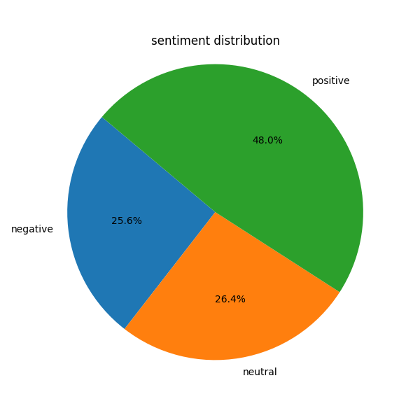
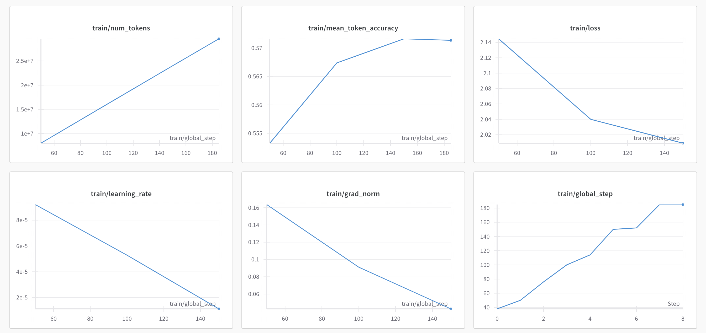
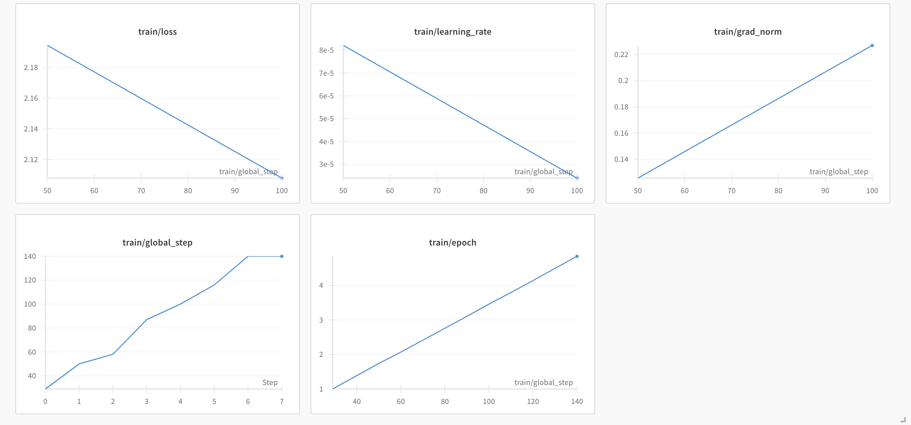
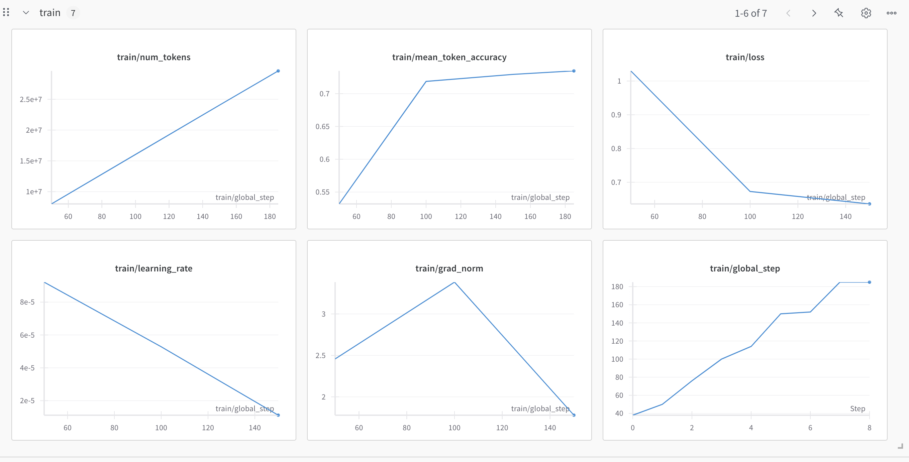
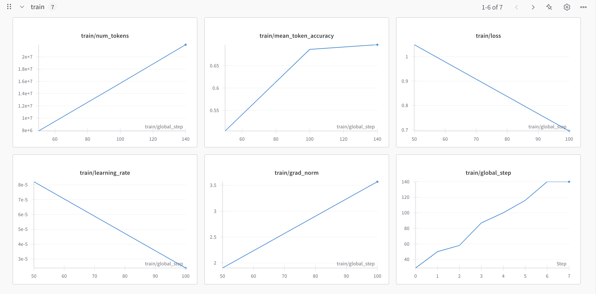
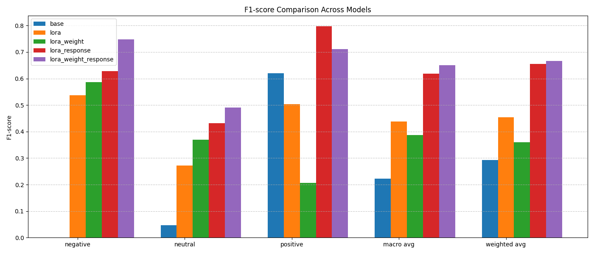

## AIDF 实习任务总结报告

姓名：CHEN HAO

email: <CH0008AO@e.ntu.edu.sg>

### 一、实习任务背景

本次实习任务来源于 AIDF-CRI 实习项目，任务方向为轻量化大语言模型（LLM）的微调优化，旨在通过对开源模型进行轻量级调优，使其更好适应金融情绪分类任务。所使用的基础模型为 Qwen2.5-0.5B。

### 二、项目目标

- 探索低资源下的大模型微调方法，如 LoRA。
- 结合数据处理（如下采样）与 loss 策略优化，提高模型在金融情绪识别任务中的表现。
- 搭建一套完整的训练、测试与部署流程。

### 三、实验设置与模型列表

本项目共微调了五种模型配置，均基于 Qwen2.5-0.5B 架构：

1. **LoRA 微调**

   - 标准的 LoRA 参数注入 (`q_proj`, `v_proj`)
   - 保留原始训练数据

2. **LoRA + 下采样**

   - 对样本标签类别不平衡问题进行下采样，增强训练稳定性
   - 使用与模型1相同的 LoRA 配置

3. **LoRA + 只计算 response loss**

   - 在训练中只对 response 部分计算 loss，跳过 prompt 部分
   - 使用 `DataCollatorForCompletionOnlyLM`，明确 response 模板以便 loss mask 标注

4. **LoRA + 下采样 + 只计算 response loss**

   - 综合模型2和模型3的优势
   - 对训练集下采样处理 + 精准控制 loss 区间

5. **Base Zero-Shot**（对比基线）

   - 使用未调优的 Qwen2.5-0.5B 基础模型，做 zero-shot 推理

### 四、数据来源与处理


划分后的数据集如下：

- 训练集：7147 条
- 验证集：1021 条
- 测试集：908 条

数据集共包含 10130 篇新闻，分布如下：

| 月份              | 新闻数量           |
| --------------- | -------------- |
| 2024年6月         | 130            |
| 2024年7月-2025年4月 | 各1000篇，共10000篇 |

数据来源为商业数据供应商，新闻类别涵盖 "Top"、"Business"、"World"、"Technology"。

数据文件如下：

- `Predefined list of events.xlsx`：定义的事件和实体清单
- `Financial News.json`：新闻原文与元信息
- `Financial News Label.json`：GPT-4o-mini 对新闻中事件、实体的标注结果

标签仅针对 "Related" 类型新闻，包括以下相关类别：

- Business, Companies, Politics, Economy, Tech
- Sustainability, Legal, Technology, Real Estate, Climate

本任务主要聚焦于 "Related" 类型新闻中的情绪判断。

在预处理阶段，我们：

- 依据事件标签文件进行投票融合，确定最终情绪标签（positive / neutral / negative）
- 剔除 "Unrelated" 类别新闻，包括：Health、Style、Sports、Work & Careers、Life & Arts

#### 📊 情绪标签分布图

以下为情绪**分布**情况饼图（基于清洗后的 9076 条有效样本，用于验证数据质量与类别分布的平衡性）：




- positive: 48.0%
- neutral: 26.4%
- negative: 25.6%

此外，清洗过程共跳过 1069 条无效样本，主要为不相关新闻类型或无情绪信息：

- 跳过类型总数：941 条（如 Life & Arts、Sports、Health 等）
- 无有效情绪信息：69 条
- 剩余有效数据量：9076 条


### 五、训练与部署技术栈

#### ⚙️ 模型参数统计
- 总参数量（Qwen2.5-0.5B）：**494,573,440**
- LoRA 微调参数量：**540,672**（约占 0.11%）

#### 🚀 推理性能优化配置
模型加载配置：
```python
model = AutoModelForCausalLM.from_pretrained(
    model_path,
    torch_dtype=torch.bfloat16,
    attn_implementation="flash_attention_2"
)
```
- 使用 bfloat16 降低显存开销
- 启用 flash-attention-2 提升注意力模块效率

推理性能测试结果：

| 配置                         | 推理时间（ms） |
|------------------------------|----------------|
| 默认配置                     | 183.42         |
| 启用优化配置                 | 56.10          |

推理速度提升约 **3.3 倍**

#### 🔧 微调与部署工具链
- 使用 Huggingface `transformers` + `trl.SFTTrainer` 进行指令微调
- 使用 `wandb` 跟踪训练过程
- 模型支持多轮 checkpoint 对比与恢复
- 提供 CLI + Flask API 双模式部署，支持响应时间监控

#### 💻 模型推理调用示例
**API 请求示例：**
```python
import requests

response = requests.post(
    "http://localhost:8000/predict",
    json={"text": "美联储宣布降息50bp, 投资者纷纷买入股票，股市大涨！"}
)

print(response.json())
```
**返回示例：**
```json
{
  "input": "美联储宣布降息50bp, 投资者纷纷买入股票，股市大涨！",
  "prediction": "positive",
  "time_ms": 113.98
}
```
**CLI 调用模型推理：**
```bash
python -m scripts.predict \
    --text "美联储宣布降息50bp, 股票市场大涨" \
    --model_path ./models/qwen_lora_emotion_weight/final \
    --log_path ./logs/inference.log
```
**Flask API 调用模型推理：**
```bash
python -m mini_inference_flask.app
python mini_inference_flask/test.py
```

### 六、评估与结果

#### 🧾 Prompt 示例

以下为模型训练中使用的典型输入格式示例：

```json
<|user|>
新闻内容：Google investeer miljarde in sy SA-wolk Jan Vermeulen, redakteur van MyBroadband, verduidelik wat 'n Google-wolkstreek is, hoekom dit so duur is, en waarom die groot tegnologiese reuse hulle beleggings in Suid-Afrika vermeerder. Jy kan ook na die potgooi op iono.fm luister.
<|assistant|>
这篇新闻的情绪是：positive
```

#### 📈 LoRA 微调模型训练过程可视化（WandB）

下图为 **LoRA 微调**、**LoRA + 下采样** 和 **LoRA + response loss**、**LoRA + 下采样 + response loss** 等不同配置下的训练监控指标，展示了 loss、学习率、梯度范数等随训练步骤的变化趋势：

**LoRA 微调训练图：**



**LoRA + 下采样训练图：**



**LoRA + response loss 训练图：**



**LoRA + 下采样 + response loss 训练图：**



- 使用分类报告（precision / recall / f1-score）+ 混淆矩阵作为评估指标
- 对比不同模型的表现，绘制了 F1-score 对比图表


#### 🧪 各模型测试指标对比

以下为不同模型在测试集（共908条）上的最终 F1-score 对比图：



以下为五种模型在测试集上的性能表现对比（包含已补充的两种配置）：

| 模型配置                         | Accuracy | Macro-F1 | Weighted-F1 | Negative F1 | Neutral F1 | Positive F1 |
|----------------------------------|----------|----------|--------------|--------------|-------------|--------------|
| LoRA 微调                        | 0.46     | 0.44     | 0.45         | 0.54         | 0.27        | 0.50         |
| LoRA + 下采样                    | 0.41     | 0.39     | 0.36         | 0.59         | 0.37        | 0.21         |
| LoRA + 只计算 response loss     | 0.66     | 0.62     | 0.65         | 0.63         | 0.43        | 0.80         |
| LoRA + 下采样 + response loss   | 0.65     | 0.65     | 0.67         | 0.75         | 0.49        | 0.71         |
| Base Zero-Shot（未调优模型）    | 0.45     | 0.22     | 0.29         | 0.00         | 0.05        | 0.62         |


#### 📋 各模型完整分类报告与混淆矩阵

##### 1️⃣ Base Zero-Shot（未调优模型）
```
             precision    recall  f1-score   support
negative       0.00      0.00      0.00       267
neutral        0.25      0.03      0.05       230
positive       0.45      0.98      0.62       411
accuracy                           0.45       908
macro avg      0.23      0.33      0.22       908
weighted avg   0.27      0.45      0.29       908
```
混淆矩阵：
```
[[  0   8 259]
 [  0   6 224]
 [  0  10 401]]
```

##### 2️⃣ LoRA 微调
```
             precision    recall  f1-score   support
negative       0.45      0.66      0.54       267
neutral        0.28      0.26      0.27       230
positive       0.59      0.44      0.50       411
accuracy                           0.46       908
macro avg      0.44      0.45      0.44       908
weighted avg   0.47      0.46      0.45       908
```
混淆矩阵：
```
[[177  44  46]
 [ 92  60  78]
 [124 107 180]]
```

##### 3️⃣ LoRA + 下采样
```
             precision    recall  f1-score   support
negative       0.48      0.74      0.59       267
neutral        0.28      0.53      0.37       230
positive       0.68      0.12      0.21       411
accuracy                           0.41       908
macro avg      0.48      0.46      0.39       908
weighted avg   0.52      0.41      0.36       908
```
混淆矩阵：
```
[[198  61   8]
 [ 94 121  15]
 [117 244  50]]
```

##### 4️⃣ LoRA + 只计算 response loss
```
             precision    recall  f1-score   support
negative       0.82      0.51      0.63       267
neutral        0.41      0.46      0.43       230
positive       0.74      0.87      0.80       411
accuracy                           0.66       908
macro avg      0.65      0.61      0.62       908
weighted avg   0.68      0.66      0.65       908
```
混淆矩阵：
```
[[136 104  27]
 [ 24 105 101]
 [  6  48 357]]
```

##### 5️⃣ LoRA + 下采样 + 只计算 response loss
```
             precision    recall  f1-score   support
negative       0.75      0.75      0.75       267
neutral        0.42      0.60      0.49       230
positive       0.82      0.63      0.71       411
accuracy                           0.65       908
macro avg      0.66      0.66      0.65       908
weighted avg   0.70      0.65      0.67       908
```
混淆矩阵：
```
[[199  54  14]
 [ 50 137  43]
 [ 16 137 258]]
```

#### 🔍 模型对比分析总结

从以上评估结果可以看出：

- **LoRA + response loss** 和 **LoRA + 下采样 + response loss** 在准确率、F1 得分上表现最优，尤其是在 positive 类别上取得较高的召回率与整体平衡。
- **Base Zero-Shot** 模型在未训练的条件下表现极其依赖 dominant label，准确率虽为 45%，但严重偏向 positive 类别。
- **LoRA 微调** 在未处理类别不平衡与 prompt-loss 混合情况下，整体表现平庸。
- **LoRA + 下采样** 模型虽然类别均衡，但对大类样本的学习能力受限，导致在 positive 类别上表现最弱。

综合来看，合理的数据处理策略（如 response-only loss + 下采样）能够显著提升小模型在不平衡金融情绪分类任务中的表现。

---

#### ⚠️ 训练过程中的挑战与问题

在训练过程中，遇到以下问题需特别注意：

- **长文本截断导致 response 丢失**：由于输入序列较长，在启用截断（truncation）后，部分样本可能无法保留完整的 response_template 内容，导致 `DataCollatorForCompletionOnlyLM` 无法识别 response 起始位置，进而无法正确计算该部分的 loss。
  - **建议解决方案**：
    - 对 prompt 长度进行控制，限制输入中非关键信息；
    - 或使用更高 `max_seq_length` 的模型架构；
    - 或在预处理阶段进行截断保护，即确保 response_template 在截断后仍被完整保留。

---

### 七、总结与收获

#### 🤔 思考与反思

本项目在使用下采样技术处理类别不平衡问题时，虽然有效提升了训练集的情绪类别分布平衡性，但也带来了训练样本数量的减少。

- 原始训练集样本数量：7147 条
- 下采样后的训练集样本数量：5430 条
- 类别分布如下：
  - negative：1810
  - neutral：1910
  - positive：3427（最初） → 下采样后与最小类别对齐
  - 下采样基准类别：negative（1810 条）

这种方式提升了类别均衡性，但在小样本场景中可能损失信息丰富度，影响模型泛化能力。针对这种情况，未来可尝试以下优化策略：

- 引入带类别权重的 loss 计算（如 `class_weighted cross-entropy`）替代硬性下采样；
- 增强小类样本的学习关注，而不是压缩大类样本；
- 结合下采样与权重动态调整机制，实现稳健且高效的训练。

---


- 精调方式对小模型效果影响显著，loss mask 策略尤为关键
- 数据集质量与类别平衡对最终效果有决定性作用
- 实践中掌握了完整的大模型微调流程，包括训练、验证、评估与部署

### 八、后续工作建议

- 支持 **批量推理接口** 与 **异常处理机制**（如文本为空、超出最大长度等），提升模型的实用性和鲁棒性
- 基于当前推理时间分析，进一步压缩推理耗时（目标 <50ms），可探索更高效的模型部署方式（如 ONNX、TensorRT）


- 尝试引入权重再训练机制（如 DPO 或 GRPO）
- 扩展数据来源，提升模型的泛化能力
- 进一步优化 prompt 格式设计和 response 模板

---

### 九、项目访问链接

所有模型、数据和代码均已托管至 Google Drive，可通过以下链接访问：
[🔗 点击访问项目文件夹](https://drive.google.com/drive/folders/1xV2TDKDeNFm2qSym35wSV_W-FDpRcRMd?usp=drive_link)

> Google Drive只保存了效果做好的final model, 如果想要查看其他模型结果，需要通过训练文件，自己生成
 
如需补充每个模型的具体指标表现、图示或 wandb 跟踪链接，请随时告诉我。

